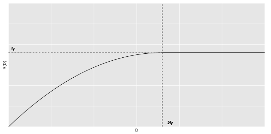
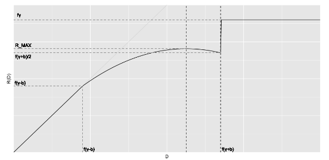

---
header-includes:
- \usepackage{enumitem}
- \usepackage{amsmath}
- \usepackage{float}
- \usepackage{pdfpages}
- \usepackage{caption}
- \usepackage[spanish]{babel}\decimalpoint
output:
  pdf_document: default
---

```{r setup, include=FALSE}
knitr::opts_chunk$set(echo=T, message=FALSE, warning=FALSE, 
                       fig.align='center', eval=T)
```


Realice los siguientes ejercicios con el equipo señalado.

**1. Resuelva los ejercicios 10.4 y 10.5 (5a edición). Realice estos con ayuda de su laboratorista y entregue las soluciones escritas a máquina, utilizando LaTeX. [1 hora, 1 punto cada pregunta]**

**10.4 A simpler approach to agency costs: limited pledgeability. (Lacker and Weinberg, 1989; Holmstrom and Tirole, 1998.) Consider the model of Section 10.2 with a different friction: there is no cost of verifying output, but the entrepreneur can hide fraction $1-f$ of the project’s output from the investor (with $0\le f\le1$). Thus the entrepreneur can only credibly promise to repay fraction $f$ of the project’s output**

**a) Consider a project with expected payoff $\gamma$ that exceeds $1+r$. What is the condition for the project to be undertaken?**
Denotaremos al producto del proyecto como $X$ que es una variable aleatoria que se distribuye $U(0,2\gamma)$. Ademas sabemos que $\mathbb{E}(X)=\gamma$. Tenemos que $\gamma>1+r$. La empresa acepta el proyecto si, en promedio, la ganancia de la empresa (el producto del proyecto menos el pago a la inversionista) es mayor que si invirtiera toda su riqueza ($W$) a la tasa libre de riesgo ($r$). Es decir, si 

$$
\gamma - \mathbb{E} (PMT) \geq (1+r) W \\ \gamma-(1+r)W \geq \mathbb{E} (PMT)
$$
donde $PMT$ representa el pago a la inversionista. Por otro lado, la inversionista toma una decision similar. Ella busca que el pago que reciba sea mayor, en promedio, a que si invirtiera sus recursos $(1-W)$ a la tasa $r$. Es decir
$$\mathbb{E}(PMT)\ge(1+r)(1-W)$$
En conjunto, ambas condiciones son
$$(1+r)(1-W)\le\mathbb{E}(PMT)\le \gamma-(1+r)W$$

**(b) Suppose the condition you found in part $(a)$ is satisfied with strict inequality. Is the contract between the investor and the entrepreneur uniquely determined? If so, what is the contract? If not, explain why.**

El contrato entre la empresa y la inversionista es que la inversionista le presta $1-W$ a la empresa y esta promete pagarle una cantidad $D$. Denotamos al producto reportado como $\tilde{X}=fX$. Sabemos que $\tilde{X}\sim U(0,2f\gamma)$.
\footnote{Sea $X\sim U(0,\theta)$ y $Y=cX$. Sabemos que $F_X(x)=x/\theta$. Entonces $F_Y(y)=\mathbb{P}(Y\leq y)=\mathbb{P}(cX\leq y)=\mathbb{P}(X\leq y/c)=F_X(y/c)=(y/c)/\theta=y/(c\theta)$. Por lo tanto $Y\sim U(0,c\theta)$.}

Si $D\le2f\gamma$, tenemos dos casos
\[PMT=\begin{cases} 
\tilde{X} & \tilde{X}\le D\\
D & \tilde{X}>D
\end{cases}
\]
$$
\mathbb{E}(PMT)=\mathbb{E}(\tilde{X}\mid \tilde{X}\leq D)\mathbb{P}(\tilde{X}\leq D)+\mathbb{E}(D\mid \tilde{X}>D)\mathbb{P}(\tilde{X}>D)
$$
$$
\mathbb{E}(PMT)=\frac{D}{2}\frac{D}{2f\gamma}+D\frac{2f\gamma-D}{2f\gamma}
$$
$$
\mathbb{E}(PMT)=\frac{D^2}{4f\gamma}+D\left(1-\frac{D}{2f\gamma}\right) 
$$
$$
\mathbb{E}(PMT)=D-\frac{D^2}{4f\gamma}
$$
$$
\mathbb{E}(PMT)=D\left(1-\frac{D}{4f\gamma}\right) \\
$$

Si $D>2f\gamma$, entonces $\tilde{X}\le D$ con probabilidad 1 y por lo tanto el pago a la inversionista siempre será $\tilde{X}$. En este caso 
$$\mathbb{E}(PMT)=\mathbb{E}(\tilde{X})=\frac{2f\gamma+0}{2}=f\gamma$$
En resumen tenemos que 
\[R(D):=\mathbb{E}(PMT)=\begin{cases} 
D\left(1-\frac{D}{4f\gamma}\right) & D\le2f\gamma\\
f\gamma & D>2f\gamma
\end{cases}
\]

Fijándonos en el primer caso
$$ 
\implies R'(D)=1-\frac{D}{2f\gamma}=0 \\ 
\iff2f\gamma=D:=D^*
$$

Notemos que 
$$
R''(D)=-\frac{1}{2f\gamma}<0
$$
Por lo tanto, $D^*$ maximiza $R(D)$ y tenemos que
$$
R(D^*)=2f\gamma\left(1-\frac{2f\gamma}{4f\gamma}\right)\\
\hspace{0.63cm}=f\gamma:=R^{MAX}
$$

{ width="435" height="214" style="display: block; margin: 0 auto" }

Hagamos un mayor análisis del contrato. Denotemos al pago mínimo requerido por la inversionista como $V=(1+r)(1-W)$. Tenemos tres casos:

1) $\boldsymbol{V>R^{MAX}}$ La inversionista nunca le presta a la empresa, sin importar $r$.

2) $\boldsymbol{V=R^{MAX}}$ Hay una infinidad de valores de $D$ que le otorgan (en promedio) su pago mínimo requerido. Sin embargo, el equilibrio competitivo es la mínima $D$ que le otorga su pago. Es decir, $D=2f\gamma$. La explicación es que si un inversionista  hace un préstamo con una $D$ mas alta, otros inversionistas podrían prestar a mejores términos. Poniendo presión a la baja a esta $D$ mas alta. 

3) $\boldsymbol{V<R^{MAX}}$ Hay un único valor de $D$, que le otorga (en promedio) a la inversionista su pago mínimo requerido. 

Concluimos que el contrato es único. 

**(c) Limited pledgeability leads to inefficiency (relative to the case of no frictions) if $\gamma>1+r$ but the project is not undertaken. Describe whether each of the following can cause a project with $\gamma>1+r$ not to be undertaken:}
Podemos responder esta pregunta simplemente fijándonos en $V=(1+r)(1-W)$.**

1) **A fall in the entrepreneur’s wealth** $W$. 

Si $W$ disminuye, $V$ aumenta. Podría aumentar tal que $V>R^{MAX}$, y en este caso, no se aceptaría el proyecto.

2) **An increase in the fraction of the project the entrepreneur can hide,** $1-f$ **(that is, a fall in** $f$**)**.

Tambien afectaria. Supongamos que $f$ disminuye a $f'$ y que inicialmente $D=D^*$ por lo que $R(D)=R^{MAX}=f\gamma$. Con el cambio, $R'^{MAX}=f'\gamma<R_{MAX}$. Entonces ahora la empresa es incapaz de ofrecerle el mismo pago esperado, por lo que la inversionista rechaza el proyecto.   

3) **An increase in idiosyncratic risk. Concretely, suppose that (as in part (d) of Problem 10.3), the output of the project is distributed uniformly on** $[\gamma-b,\gamma+b]$ **rather than uniformly on** $[0,2\gamma]$**, and there is an increase in** $b$. 

Resolvemos el ejercicio. $X\sim U(\gamma-b,\gamma+b)$ y $\tilde{X}=fX\sim U(f(\gamma-b),f(\gamma+b))$.\footnote{Sea $X\sim U(a,b)$ y $Y=cX$. Sabemos que $F_X(x)=x/(b-a)$. Entonces $F_Y(y)=\mathbb{P}(Y\le y)=\mathbb{P}(cX\le y)=\mathbb{P}(X\le y/c)=F_X(y/c)=(y/c)/(b-a)=y/(c(b-a))=y/(cb-ca)$. Por lo tanto $Y\sim U(ac,bc)$.}

Notemos que 
$$F_{\tilde{X}}(x)=\frac{x}{f(\gamma+b)-f(\gamma-b)}=\frac{x}{2fb}$$

Si $D\le f(\gamma-b)$, la empresa le paga a la inversionista $D$ con probabilidad 1.
$$\mathbb{E}(PMT)=D$$
Si $f(\gamma-b)<D\le f(\gamma+b)$, tenemos dos casos
\[PMT=\begin{cases} 
\tilde{X} & \tilde{X}\le D\\
D & \tilde{X}>D
\end{cases}
\]

$$
\mathbb{E}(PMT)=\mathbb{E}(\tilde{X}\mid \tilde{X}\le D)\mathbb{P}(\tilde{X}\le D)+\mathbb{E}(D\mid \tilde{X}>D)\mathbb{P}(\tilde{X}>D)
$$
$$
\mathbb{E}(PMT)=\frac{f(\gamma-b)+D}{2}\frac{D}{2fb}+D\frac{2fb-D}{2fb}
$$
$$
\mathbb{E}(PMT)=\frac{D}{4fb}\left(f\gamma+3fb-D\right)
$$

Si $D>f(\gamma+b)$, entonces $\tilde{X}\le D$ con probabilidad 1 y por lo tanto el pago a la inversionista siempre será $\tilde{X}$. En este caso 
$$\mathbb{E}(PMT)=\mathbb{E}(\tilde{X})=\frac{f(\gamma-b)+f(\gamma+b)}{2}=\frac{2f\gamma}{2}=f\gamma$$
En resumen tenemos que 
\[R(D):=\mathbb{E}(PMT)=\begin{cases} 
D & D\le f\gamma-fb\\
\frac{D}{4fb}\left(f\gamma+3fb-D\right) & f\gamma-fb<D\le f\gamma+fb\\
f\gamma & D>f\gamma+fb
\end{cases}
\]
Fijándonos en el segundo caso
$$
\implies R'(D)=\frac{1}{4fb}\left(f\gamma+3fb-2D\right)=0\\
\iff D^*=D=\frac{f\gamma+3fb}{2}
$$

Y por lo tanto
$$
R(D^*)=\frac{\frac{f\gamma+3fb}{2}}{4fb}\left(f\gamma+3fb-\frac{f\gamma+3fb}{2}\right)
$$
$$
R(D^*)=\frac{\gamma+3b}{8b}\left(\frac{f\gamma+3fb}{2}\right)
$$
$$
R(D^*)=\frac{f(\gamma+3b)^2}{16b}
$$
$$
R(D^*)=\frac{f}{b}\left(\frac{\gamma+3b}{4}\right)^2:=R^{MAX} 
$$

{ width="435" height="214" style="display: block; margin: 0 auto" }

Sin hacer mayor análisis, notamos que el valor máximo del valor esperado del pago ($f\gamma$) no depende de $b$. Este máximo valor se alcanza cuando $D=f(\gamma+b)$. Ademas, para cualquier otra $D<f(\gamma+b)$, la empresa puede ofrecer un pago esperado tal que se celebre el contrato. Cambios en $b$ no afectan esta decision.  


**10.5 (a) Show that in the model analyzed in equations (10.15)-(10.23) of Section 10.4, the unconditional distributions of $C^a_{2t}$ and $C^n_{2t}$ are not normal.} De la ecuación (10.15), sabemos que el consumo en el periodo dos esta dado por**

$$C_{2t}^a=(r+p_{t+1}-(1+r)p_t)X_t^a$$

Dada la información en $t$, $p_t$ es una constante. Entonces el único factor estocastico es $p_{t+1}$, el cual es lineal en $\eta_{t+1}$. Entonces dada la información en $t$, $C_{2t}^a$ se distribuye normal.

Sin embargo, si no tenemos información en $t$, entonces $C_{2t}^a$ contiene dos factores estocasticos, $p_t$ y $p_{t+1}$. Entonces basta con que veamos que $p_t$ y $p_{t+1}$ no sean independientes, para que no podamos asegurar que $C_{2t}^a$ es normal. 

A pesar de que las $\eta's$ son independientes entre si, los precios no lo son, ya que el precio en un periodo depende, al menos, del precio en un periodo anterior. 

Analogamente para $C_{2t}^n$.  

**(b) Explain in a sentence or two why the analysis in the text, which uses the properties of lognormal distributions, is nonetheless correct.**

La media y varianza de $C_{2t}^a$ condicionada a la información en $t$ son

$$
\mathbb{E}_t(C_{2t}^a)=(r+\mathbb{E}_t(p_{t+1})-(1+r)p_t)X_t^a:=\mu\\
Var_t(C_{2t}^a)=Var_t(p_{t+1})(X_t^a)^2=V(X_t^a)^2:=W
$$
El punto es concluir que las preferencias de los agentes dependen únicamente de la media y la varianza del consumo. Entonces tenemos que

$$
\mathbb{E}(U(C))=\mathbb{E}\left(-e^{-2\gamma C}\right)
$$
$$
\mathbb{E}(U(C))=-\mathbb{E}\left(e^{-2\gamma C}\right)
$$
$$
\mathbb{E}(U(C))=-\mathbb{E}\left(\mathbb{E}_t(e^{-2\gamma C})\right)
$$
$$
\mathbb{E}(U(C))=-\mathbb{E}\left(e^{-2\gamma\mu+2\gamma^2W}\right)
$$
$$
\mathbb{E}(U(C))=-\mathbb{E}\left(e^{-2\gamma(\mu-\gamma W)}\right)
$$
$$
\mathbb{E}(U(C))=-e^{2\gamma^2W}\mathbb{E}\left(e^{-2\gamma\mu}\right)
$$

$\mu$ contiene un factor estocastico el cual es $p_t$. Sin hacer mayor desarrollo, es claro ver que la utilidad esperada se maximiza cuando $\mu$ crece y cuando $W$ decrece. Lo cual indica que el agente se fija en la media-varianza de su consumo. Igual que en el caso donde condicionamos a la información dada en $t$. 


**2. Estudie el financiamiento del sistema bancario en México a la luz del concepto de "transformación de madurez": [2 horas, 1 puntos cada inciso]**

**(a) Obtenga, del SIE/Financiamiento e información financiera de intermediarios financieros/ del Banco de México, información de las formas de financiamiento del sector bancario (comercial) mexicano, y haga gráficas describiendo la evolución en el tiempo de las distintas tipos de financiamiento (depósitos a la vista, financiamiento de mercado y otros) y de la proporción que cada uno representa del total. Es decir, hay que producir dos gráficas de series de tiempo en la que el valor total está constituido por varias partes intermedias.**

Para la siguiente respuesta se utiliza el cuadro `Principales Activos y Pasivos de la banca comercial (metodología 2018)`. La pregunta habla acerca de los depósitos a la vista y el financiamiento de mercado. Entendemos como depósitos a la vista aquellos que son de exigibilidad inmediata, mientras que excluimos de esta tipificación los depósitos a plazo. Por otro lado, definimos el financiamiento de mercado aquel que no incluya al sector público, excluyendo también a las empresas productivas del estado o empresas de participación estatal y órganos decentralizados. Se presenta una tabla con la tipificación que se acaba de definir con el nombre y número de series de banxico. 

```{r, echo=FALSE}
clase <- c('d.1. Sector privado no bancario residente',
            'd.2. Banca de desarrollo',
            'd.3. Otros intermediarios financieros públicos',
            'd.4. Sector público no financiero',
            'd.5. Sector no residente')
tipo <- paste('d.', rep(1:5,  2), c(rep('.1. De exibilidad inmediata',5), rep('.2. A plazo',5)), sep = '')
Nombres <- paste('d. Captación', clase, tipo, sep = ' - ')
series.exigibilidad <- c('SF320773','SF320776','SF320779','SF320782', 'SF320785')
series.plazo <- c('SF320774','SF320777','SF320780','SF320783', 'SF320786')
series.reporto <- c('SF320788', 'SF320790', 'SF320789', 'SF320791', 'SF320792', 'SF320793')
Serie <- c(series.exigibilidad, series.plazo, series.reporto)
Sector <- rep(c('Privado', rep('Público', 3), 'Privado'),2)
Tipo <- c(rep('A la vista', 5), rep('A plazo', 5))
clase.reporto <- c('e.1 Sector privado no bancario residente',
                   'e.2 Banco de México',
                   'e.3 Banca de desarrollo',
                   'e.4 Otros intermediarios financieros públicos',
                   'e.5 Sector público no financiero',
                   'e.6 Sector no residente')
Nombres.reporto <- paste('e. Acreedores por reporto de valores', clase.reporto,
                         sep = ' - ')
Sector.reporto <- c('Privado', rep('Público', 4), 'Privado')
Tipo.reporto <- rep('A plazo', 6)
Sector <- c(Sector, Sector.reporto)
Tipo <- c(Tipo, Tipo.reporto)
Nombres <- c(Nombres, Nombres.reporto)
tipificacion <- data.frame(Sector, Tipo, Serie, Nombres)
knitr::kable(tipificacion, caption = 'Tipificación')
```

A continuación se presentan las gráficas. 

```{r, echo=FALSE}
# Abrir sesión en API banxico
tkn <- "8bd93af99a69ac4062f645fd43e0b517c5c88bb17750149a9fce21e47f8264af"
siebanxicor::setToken(tkn)
series <- siebanxicor::getSeriesData(Serie, '2009-07-01','2022-03-01')
j = 1
for (i in match(names(series),Serie)) {
  a <- matrix(unlist(series[[j]][2]), ncol = 1)
  a <- cbind(a, rep(Serie[i], length(a)))
  if (j == 1) {
    b <- matrix(unlist(series[[j]][1]), ncol = 1)
    ds <- cbind(b,a)
    colnames(ds) <- c('Fecha' , 'Valor (miles)', 'Serie')
    j = j + 1
    next
  }
  a <- cbind(b,a)
  ds <- rbind(ds,a)
  j = j + 1
}
ds <- data.frame(ds)
ds[,2] <- as.numeric(ds[,2])
ds[,1] <- as.POSIXct.Date(as.numeric(ds[,1])+ 0.5)
ds.etl <- (merge(x = ds, y = tipificacion[,-4], by = 'Serie'))[,c(2,3,4,5)]
colnames(ds.etl)[2] <- 'Valor (miles)'
```

```{r, echo=FALSE, include=FALSE}
table.1 <- dplyr::summarise(dplyr::group_by(ds.etl, Fecha, Sector, Tipo),
                            `Depositos` = sum(`Valor (miles)`)/1000000)
table.1 <- as.data.frame(table.1)
table.1[,5] <- as.factor(paste(table.1[,2], table.1[,3]))
table.1[,5] <- forcats::fct_reorder(table.1[,5], table.1[,4], .fun = 'mean')
colnames(table.1)[5] <- 'Clase'
table.1 <- table.1[,c(1,5,4)]
plot.1 <- ggplot2::ggplot(table.1,  ggplot2::aes(x = Fecha, 
                                                y = `Depositos`, 
                                                color = Clase)) + 
  ggplot2::geom_line() + ggplot2::theme(legend.position="bottom")+
  ggplot2::labs(title = 'Captación Bancaria (comercial)',
                subtitle = 'En miles de millones de pesos nominales',
                y = '$',
                x = 'Año',
                caption = 'Fuente: Elaboración propia con datos del SIE/BANXICO')
plot.2 <- ggplot2::ggplot(table.1,  ggplot2::aes(x = Fecha, 
                                                y = `Depositos`, 
                                                fill = Clase)) + 
  ggplot2::geom_area() + ggplot2::theme(legend.position="bottom") +
  ggplot2::labs(title = 'Captación Bancaria (comercial)',
                subtitle = 'En miles de millones de pesos nominales',
                y = '$',
                x = 'Año',
                caption = 'Fuente: Elaboración propia con datos del SIE/BANXICO')

```

Podemos observar como el sector privado ha tenido una pendiente más pronunciada en cuanto al incremento de la captación. Es importante recalcar que los datos no están ajustados por la inflación, luego lo que esperaríamos sería una tendencia ascendente con respecto al tiempo. Es interesante notar que los depósitos a la vista del sector privado han incrementado de forma constante a lo largo del periodo. Existe un salto importante en 2020 debido a la pandemia, pero parece que después de ello regresa a la tendencia anterior. Con respecto a los depósitos a plazo del mismo sector, cabe resaltar que a mediados de 2015 se corta la curva de los depósitos a corto plazo, en seguida las dos clases mantienen la misma tendencia y van casi pegadas. Al inicio de la pandemia divergen y ese patrón sigue hasta marzo de 2022. Los depósitos a plazo del sector público son muy volátiles, esto se puede deber a la naturaleza de la actividad política, uno no esperaría que la gestión actual le diera demasiado peso al ahorro que podría utilizar el gobierno entrante. Los depósitos a la vista mantienen del sector público mantienen una tendencia ascendente y sin gran volatilidad.

```{r, echo=FALSE}
plot.1
```

```{r, echo=FALSE}
plot.2
```

Se muestra la participación de los sectores y clase de depósito de la banca comercial. Desde finales de 2011, los depósitos a la vista del sector privado absorbió participación de los depósitos a plazo de ese mismo sector y ha mantenido esa tendencia desde entonces. Podríamos tener la intuición que la necesidad de liquidez podría haber ido aumentando a través de los años para el sector privado. El sector público ha mantenido constante su participación en los depósitos a la vista.. Los depósitos a plazo del sector público es muy volatil. 

```{r, echo=FALSE}
table.2 <- (dplyr::mutate(
  dplyr::ungroup(
    dplyr::mutate(
      dplyr::group_by(table.1, Fecha),
    Total = sum(Depositos))
  ),
`Participación` = Depositos / Total
))[,c(1,2,5)]

plot.3 <- ggplot2::ggplot(table.2,  ggplot2::aes(x = Fecha, 
                                                y = `Participación`, 
                                                fill = Clase)) + 
  ggplot2::geom_area() + ggplot2::theme(legend.position="bottom")+
  ggplot2::labs(title = 'Captación Bancaria (comercial)',
                subtitle = 'Participación del total, corte transversal',
                y = '%',
                x = 'Año',
                caption = 'Fuente: Elaboración propia con datos del SIE/BANXICO')
plot.3 
```

**(b) Obtenga de la misma fuente información del tipo de créditos que el sistema bancario (comercial) mexicano otorga, y haga gráficas describiendo la evolución en el tiempo de distintos tipos de crédito y de la proporción que cada uno representa del total. Al igual que en el inciso anterior, hay que producir dos gráficas de series de tiempo en la que el valor total está constituido por varias partes intermedias.**

Para la siguiente respuesta se utiliza el cuadro `Banca Comercial, Financiamiento detalle (metodología 2018)`. En este caso solo nos concentraremos en el crédito del sector privado, además que se agrega una columna extra de la naturaleza del préstamo. 

```{r, echo=FALSE}

Nombres <- c('a.1.1 Sector privado - a.1.1.1 Consumo, Vigente, Sin restricción, Tarjeta de crédito', 
             'a.1.1 Sector privado - a.1.1.1 Consumo, Vigente, Sin restricción, Nómina',
             'a.1.1 Sector privado - a.1.1.1 Consumo, Vigente, Sin restricciÛn, Personales',
             'a.1.1 Sector privado - a.1.1.1 Consumo, Vigente, Sin restricciÛn, Bienes de consumo duradero',
             'a.1.1.1 Consumo, Vigente, Sin restricción, Otros',
             'a.1 Financiamiento directo - a.1.2 Vivienda',
             'a.1.1 Sector privado - a.1.1.3 Empresas y personas fÌsicas con actividad empresarial',
             'a.1 Financiamiento directo - a.1.4 Intermediarios financieros no bancarios, Valores',
             'a.2 TÌtulos asociados a programas de reestructuras'
             )
Serie <- c('SF269142', 'SF269143', 'SF269144', 'SF269145', 'SF269148',
           'SF235736', 'SF269836', 'SF269844', 'SF235739')
Tipo <- c(rep('Corto plazo', 3), 'Mediano plazo', 'Corto plazo', 'Largo plazo',
          'Mediano plazo', 'Mediano plazo', 'Largo plazo')
Banca <- c(rep('Consumo',3), 'Consumo duradero', 'Consumo', 'Vivienda', 'Empresarial', 
           'Otros', 'Otros')
Naturaleza <- c('Tarjeta de crédito', 'Nómina', 'Personales', 
                'Bienes de consumo duradero', 'Otros', 'Vivienda',
                'Empresarial', 'Intediarios no financieros', 'Programas de reestructura'
                )

tipificacion <- data.frame(Banca, Naturaleza, Tipo, Serie, Nombres)
knitr::kable(tipificacion, caption = 'Tipificación')
```
```{r, echo=FALSE}
# Abrir sesión en API banxico
tkn <- "8bd93af99a69ac4062f645fd43e0b517c5c88bb17750149a9fce21e47f8264af"
siebanxicor::setToken(tkn)
series <- siebanxicor::getSeriesData(Serie, '2009-07-01','2022-03-01')
j = 1
for (i in match(names(series),Serie)) {
  a <- matrix(unlist(series[[j]][2]), ncol = 1)
  a <- cbind(a, rep(Serie[i], length(a)))
  if (j == 1) {
    b <- matrix(unlist(series[[j]][1]), ncol = 1)
    ds <- cbind(b,a)
    colnames(ds) <- c('Fecha' , 'Valor (miles)', 'Serie')
    j = j + 1
    next
  }
  a <- cbind(b,a)
  ds <- rbind(ds,a)
  j = j + 1
}
ds <- data.frame(ds)
ds[,2] <- as.numeric(ds[,2])
ds[,1] <- as.POSIXct.Date(as.numeric(ds[,1])+ 0.5)
ds.etl <- (merge(x = ds, y = tipificacion[,-5], by = 'Serie'))[,c(2,3,4,6)]
ds.etl$Valor..miles. <- ifelse(ds.etl$Banca %in% c('Vivienda', 'Empresarial', 'Otros'), 
       ds.etl$Valor..miles. / 1000,
       ds.etl$Valor..miles.)
colnames(ds.etl)[2] <- 'Valor (miles)'
```
```{r, echo=FALSE, include=FALSE}
table.a <- table.1
table.1 <- dplyr::summarise(dplyr::group_by(ds.etl, Fecha, Banca),
                            `Depositos` = sum(`Valor (miles)`)/1000)
table.1 <- as.data.frame(table.1)
table.1[,2] <- as.factor(table.1[,2])
table.1[,2] <- forcats::fct_reorder(table.1[,2], table.1[,3], .fun = 'mean')
plot.3 <- ggplot2::ggplot(table.1,  ggplot2::aes(x = Fecha, 
                                                y = `Depositos`, 
                                                color = Banca)) + 
  ggplot2::geom_line() + ggplot2::theme(legend.position="bottom")+
  ggplot2::labs(title = 'Crédito Bancario (comercial)',
                subtitle = 'En miles de millones de pesos nominales',
                y = '$',
                x = 'Año',
                caption = 'Fuente: Elaboración propia con datos del SIE/BANXICO')
plot.4 <- ggplot2::ggplot(table.1,  ggplot2::aes(x = Fecha, 
                                                y = `Depositos`, 
                                                fill = Banca)) + 
  ggplot2::geom_area() + ggplot2::theme(legend.position="bottom") +
  ggplot2::labs(title = 'Crédito Bancario (comercial)',
                subtitle = 'En miles de millones de pesos nominales',
                y = '$',
                x = 'Año',
                caption = 'Fuente: Elaboración propia con datos del SIE/BANXICO')
```

Podemos observar que el crédito empresarial ha tenido el mayor incremento. Seguido por el crédito a consumo de bienes no durables y vivienda. Notar como todo el crédito excepto el hipotecario se redujo notablemente, lo anterior se debe a que el crédito a la vivienda es a muy largo plazo y se suaviza conforme a choques exógenos. Por otro lado, notar que aunque el crédito empresarial se toma crédito a mediano plazo junto con el de bienes de consumo durable porque está compuesto por crédito de varios horizontes. Lo anterior puede verse en la variabilidad que hubo en marzo de 2020.  

```{r, echo=FALSE}
plot.3
```

```{r, echo=FALSE}
plot.4
```

Notar que el aumento en la participación del crédito empresarial fue absorbido por el consumo no duradero y un pequeño aumento en la participación del crédito hipotecario, que se ve más pronunciado después de marzo de 2020. Ahora realizaremos un análisis pero con respecto a los plazos del crédito que se han propuesto. Recordar que no es posible desagregar el crédito empresarial en plazos con los datos obtenidos y se ha catalogado como plazo medio. 

```{r, echo=FALSE}
table.b <- table.2
table.2 <- (dplyr::mutate(
  dplyr::ungroup(
    dplyr::mutate(
      dplyr::group_by(table.1, Fecha),
    Total = sum(Depositos))
  ),
`Participación` = Depositos / Total
))[,c(1,2,5)]

plot.5 <- ggplot2::ggplot(table.2,  ggplot2::aes(x = Fecha, 
                                                y = `Participación`, 
                                                fill = Banca)) + 
  ggplot2::geom_area() + ggplot2::theme(legend.position="bottom")+
  ggplot2::labs(title = 'Crédito Bancario (comercial)',
                subtitle = 'Participación del total, corte transversal',
                y = '%',
                x = 'Año',
                caption = 'Fuente: Elaboración propia con datos del SIE/BANXICO')
plot.5 
```

Podemos observar que de acuerdo a la definición de temporalidad que seguimos, parece que las formas cualitativas del consumo no durable, hipotecario y crédito empresarial explican la diversificación de horizonte de los activos bancarios. 

```{r, echo=FALSE, include=FALSE}
table.c <- table.1
table.1 <- dplyr::summarise(dplyr::group_by(ds.etl, Fecha, Tipo),
                            `Depositos` = sum(`Valor (miles)`)/1000)
table.1 <- as.data.frame(table.1)
table.1[,2] <- as.factor(table.1[,2])
table.1[,2] <- forcats::fct_reorder(table.1[,2], table.1[,3], .fun = 'mean')
plot.6 <- ggplot2::ggplot(table.1,  ggplot2::aes(x = Fecha, 
                                                y = `Depositos`, 
                                                color = Tipo)) + 
  ggplot2::geom_line() + ggplot2::theme(legend.position="bottom")+
  ggplot2::labs(title = 'Crédito Bancario (comercial)',
                subtitle = 'En miles de millones de pesos nominales',
                y = '$',
                x = 'Año',
                caption = 'Fuente: Elaboración propia con datos del SIE/BANXICO')
plot.7 <- ggplot2::ggplot(table.1,  ggplot2::aes(x = Fecha, 
                                                y = `Depositos`, 
                                                fill = Tipo)) + 
  ggplot2::geom_area() + ggplot2::theme(legend.position="bottom") +
  ggplot2::labs(title = 'Crédito Bancario (comercial)',
                subtitle = 'En miles de millones de pesos nominales',
                y = '$',
                x = 'Año',
                caption = 'Fuente: Elaboración propia con datos del SIE/BANXICO')
```

Lo mismo sucede con la participación. 

```{r, echo=FALSE}
table.d <- table.2
table.2 <- (dplyr::mutate(
  dplyr::ungroup(
    dplyr::mutate(
      dplyr::group_by(table.1, Fecha),
    Total = sum(Depositos))
  ),
`Participación` = Depositos / Total
))[,c(1,2,5)]

plot.8 <- ggplot2::ggplot(table.2,  ggplot2::aes(x = Fecha, 
                                                y = `Participación`, 
                                                fill = Tipo)) + 
  ggplot2::geom_area() + ggplot2::theme(legend.position="bottom")+
  ggplot2::labs(title = 'Crédito Bancario (comercial)',
                subtitle = 'Participación del total, corte transversal',
                y = '%',
                x = 'Año',
                caption = 'Fuente: Elaboración propia con datos del SIE/BANXICO')
plot.8 
```

**(c) Explique si los datos son consistentes con la hipótesis de que los bancos hacen transformación de madurez o si no lo son y porqué. Para ello posiblemente tenga que hacer supuestos (razonables) o buscar información adicional acerca de la madurez de los distintos tipos de financiamiento y crédito otorgado.**

Supuestos:

1) Consideramos solamente el sector privado, puesto que suponemos que los bancos comerciales no tienen riesgo de corrida bancaria por parte del sector público ya que existe un _planificador_ benevolente (presidente de la respública) que no tienen incentivos para que ello suceda.

2) Suponemos que solo aquellos depósitos de exigibilidad inmediata pueden ser retirados antes de plazo. A dichos instrumentos se les denomina _depositos a la vista_.

3) Suponemos que todo depósito o pasivo del banco no _deposito a la vista_ excepto los denominados de exigibilidad inmediata. 

4) Se supone que el crédito con horizonte a corto plazo es sostenible por sí mismo y que aquellos agentes con _depósitos a la vista_ aguardan el horizonte de corto plazo para retirar su liquidez.

5) Suponemos que el horizonte del crédito bancario se distribuye de acuerdo a la tabla 2 y el riesgo es el mismo para cada horizonte.

6) Se asume que los banco no toman en cuenta los depósitos de regulación para tomar su decisión de diversificación de créditos y pasivos.

Definición (Transformación de madurez):

Definimos transformación de madurez como el ratio de activos financiados por el banco con los depósitos a la vista.

Intuitivamente bajo nuestra definición, la transformación de madurez explica cuál es el porcentaje de pasivos a corto plazo que se transforman y financian activos de largo plazo.

Proposición:

Bajo los supuestos 1) a 5) podemos caracterizar la transformación de la madurez como:

$$
\Gamma = \frac{\text{Activos}_{\text{privados}}\text{ a mediano y largo y plazo} - \text{Pasivos}_{\text{privados}} \text{ a largo plazo}}{\text{Depósitos a la vista privados}}
$$

Demostración:

Bajo el supuesto 1) no requerimos activos del sector público, entonces solo nos concentramos en activos privados. 
Bajo el supuesto 2), los activos a corto plazo son aquellos que denominamos _depositos a la vista_.
Bajo el supuesto 3) todo aquel pasivo que no sea depósito a la vista es pasivo de largo plazo y por tanto restará al total de activos porque estará financiando parte del total.
Bajo el supuesto 4) los pasivos a corto plazo no se toman en cuenta.
Bajo el supuesto 5) los activos del banco se dividen en mediano y largo plazo.
Bajo el supuesto 6) es suficiente con el monto de los activos que no incluyen a los reguladores.

Calculamos y graficamos la transformación de madurez para cada periodo. Podemos observar que bajo los supuestos planteados, el boom de la transformación de madurez bancaria se dio a inicios de 2015 y se ha mantenido entre los valores de 0.2 y 0.3.

```{r, echo = F}
pasivos.vista <- as.data.frame(dplyr::filter(table.a, Clase == 'Privado A la vista'))
pasivos.largo <- as.data.frame(dplyr::filter(table.a, Clase == 'Privado A plazo'))
activos.medianoYlargo <- as.data.frame(dplyr::ungroup(
  (dplyr::summarize(
    dplyr::group_by(
      dplyr::filter(table.1, Tipo %in% c('Mediano plazo', 'Largo plazo')),
    Fecha),
  Activos = sum(Depositos)))))

ratio.1 <- ifelse((activos.medianoYlargo$Activos - pasivos.largo$Depositos) / pasivos.vista$Depositos < 0, 0, (activos.medianoYlargo$Activos - pasivos.largo$Depositos) / pasivos.vista$Depositos)

table.3 <- pasivos.vista[,c(1,3)]
table.3[,2] = ratio.1
colnames(table.3)[2] = 'Transformación'

plot.9 <- ggplot2::ggplot(table.3,  ggplot2::aes(x = Fecha, 
                                                y = `Transformación`)) +
  ggplot2::geom_area() + ggplot2::theme(legend.position="bottom")+
  ggplot2::labs(title = 'Transformación de madurez bancaria',
                subtitle = 'Bajo supuestos 1, 2, 3, 4, 5',
                y = 'Gamma',
                x = 'Año',
                caption = 'Fuente: Elaboración propia con datos del SIE/BANXICO')
plot.9
```

Aligeremos el supuesto 4 como 

4.1) Se supone que la mitad del crédito con horizonte a corto plazo es sostenible por sí mismo y que aquellos agentes con _depósitos a la vista_ aguardan el horizonte de corto plazo para retirar su liquidez.

Bajo los supuestos 1) a 4.1) y 5) podemos caracterizar la transformación de la madurez como:

$$
\Gamma' = \frac{0.5\text{Activos}_{privados}\text{ a corto plazo}+\text{Activos}_{\text{privados}}\text{ a mediano y largo y plazo} - \text{Pasivos}_{\text{privados}} \text{ a largo plazo}}{\text{Depósitos a la vista privados}}
$$

Calculemos el gamma prima. Notamos que el ratio, naturalmente, es mayor pero nunca rebasa niveles de 0.52. En ambos casos 2015 es el punto coyuntural. 

```{r, echo = F}
pasivos.vista <- as.data.frame(dplyr::filter(table.a, Clase == 'Privado A la vista'))
pasivos.largo <- as.data.frame(dplyr::filter(table.a, Clase == 'Privado A plazo'))
activos.medianoYlargo <- as.data.frame(dplyr::ungroup(
  (dplyr::summarize(
    dplyr::group_by(
      dplyr::filter(table.1, Tipo %in% c('Mediano plazo', 'Largo plazo')),
    Fecha),
  Activos = sum(Depositos)))))
activos.corto <- as.data.frame(dplyr::ungroup(
  (dplyr::summarize(
    dplyr::group_by(
      dplyr::filter(table.1, Tipo %in% c('Corto plazo')),
    Fecha),
  Activos = sum(Depositos)))))

ratio.2 <- ifelse((activos.medianoYlargo$Activos - pasivos.largo$Depositos + activos.corto$Activos * 0.5) / pasivos.vista$Depositos < 0, 0, (activos.medianoYlargo$Activos - pasivos.largo$Depositos + activos.corto$Activos * 0.5) / pasivos.vista$Depositos)

table.4 <- pasivos.vista[,c(1,3)]
table.4[,2] = ratio.2
colnames(table.4)[2] = 'Transformación'

plot.9 <- ggplot2::ggplot(table.4,  ggplot2::aes(x = Fecha, 
                                                y = `Transformación`)) +
  ggplot2::geom_area() + ggplot2::theme(legend.position="bottom")+
  ggplot2::labs(title = 'Transformación de madurez bancaria',
                subtitle = 'Bajo supuestos 1, 2, 3, 4.1, 5',
                y = 'Gamma prima',
                x = 'Año',
                caption = 'Fuente: Elaboración propia con datos del SIE/BANXICO')
plot.9
```

**(d) Explique qué implica la evolución de las formas de financiamiento y los tipos de crédito otorgados que observó en los incisos anteriores para la estabilidad del sistema financiero a la luz del modelo Diamond-Dybvig.**

Como se mostró en los puntos anteriores, los agentes parecen haber aumentado su preferencia sobre la liquidez que otorgan los depósitos a la vista con el aumento en la participación del total de pasivos.  Este punto puede ser preocupante ya que el crédito al consumo que es a corto plazo, que es de ayuda para financiar el retiro de los depósitos a la vista, cayó durante la pandemia, mientras que el crédito a la vivienda se mantuvo con un crecimiento estable. Como se propuso en el inciso anterior, la medición de la transformación de madurez bancaria nos arroja un aumento desde el 2015 y que solo se detuvo, especulamos, momentaneamente por la pandemia. Estos factores en su conjunto pueden llevar a preguntarnos si son condiciones suficientes para dudar en los bancos y producir una corrida financiera. Ciertamente, no. Sin embargo, la participación de crédito a largo plazo ha ido en aumento, motivado por boom demográfico que ha tenido el país en las últimas décadas, y los depósitos a la vista también, estos dos factores en su conjunto nos indican el debilitamiento del sistema financiero mexicano por el canal de ahorro de los agentes y su preferencia por los depósitos a la vista. 


**(e) A propósito, documente el incremento dramático a lo largo del tiempo en el crédito hipotecario como proporción del PIB.**

La serie que se utiliza para la gráfica es la serie `494782 := PIB a precios corrientes`. Se puede apreciar el dramático incremento.

```{r, echo = F}
tkn <- '09dae22b-d57a-53f7-48e6-a83c20ccb313'
inegi.pib <- inegiR::inegi_series(series_id = '494782', token = tkn, database = 'BIE')
inegi.pib$date <- stringr::str_sub(inegi.pib$date, start = 1, end = 4)
inegi.pib <- dplyr::ungroup(
  dplyr::summarise(
    dplyr::group_by(inegi.pib, date),
  PIB = mean(values) / 1000))
colnames(inegi.pib)[1] <- 'Fecha'

hipotecario <- table.c[table.c$Banca == 'Vivienda',]
hipotecario$Fecha <-  format(hipotecario$Fecha, '%Y')
hipotecario <- dplyr::ungroup(
  dplyr::summarise(
    dplyr::group_by(hipotecario, Fecha),
  Hipotecario = mean(Depositos)))

table.5 <- merge(hipotecario, inegi.pib, by = 'Fecha')
table.5$ratio <- table.5$Hipotecario / table.5$PIB

ggplot2::ggplot(table.5, ggplot2::aes(x = as.numeric(Fecha), 
                                      y = ratio * 100)) +
  ggplot2::geom_line() +
  ggplot2::labs(title = 'Crédito a la Hipotecario como porcentaje del PIB',
                subtitle = 'Utilizando series nominales',
                y = '%',
                x = 'Año',
                caption = 'Elaboración propia con datos de INEGI y SIE/Banxico')
```


**Ejercicio 3  Estudie al gobierno mexicano y a los corporativos mexicanos desde el punto de vista de su endeudamiento [1 hora, 1 punto cada inciso]:**

```{r librerias, echo=FALSE}
#Librerias Necesarias
pacman::p_load(ggplot2,dplyr)
```


## (a) Utilice datos del SIE/Valores en Circulación y de SIE/Finanzas públicas del Banco de México para describir la evolución a lo largo del tiempo de la composición de la deuda del gobierno mexicano por tipo de instrumento, madurez y moneda. Señale la implicación de lo que encuentre para el riesgo de impago.

Con base en los datos obtenidos del SIE del Banco de México, se tiene que la deuda del gobierno mexicano por tipo de instrumento tiene la siguiente composición:

```{r, echo=FALSE,out.width="450px", out.height="350px"}
instrumentos<-read.csv("https://raw.githubusercontent.com/JobGV/Auxiliar/main/InstrumentosGobierno.csv")
instrumentos[,-c(1,2)]<-instrumentos[,-c(1,2)]/instrumentos$TOTAL

fechas<-instrumentos$Fecha %>% as.Date("%d/%m/%Y")

cetes<-instrumentos$CETES
bondes<-instrumentos$BONDES
bondesd<-instrumentos$BONDESD
bondesf<-instrumentos$BONDESF
udibonos<-instrumentos$UDIBONOS
bonos<-instrumentos$BONOS
Etiqueta<-c(rep("CETES",267),rep("BONDES",267),rep("BONDES D",267),
            rep("BONDES F",267),rep("UDIBONOS",267),rep("BONOS",267))
Valores<-c(cetes,bondes,bondesd,bondesf,udibonos,bonos)

datos<-data.frame(FECHA=rep(fechas,6),INSTRUMENTO=Etiqueta,SALDO=Valores)


ggplot(datos, aes(x=FECHA, y=SALDO, fill=INSTRUMENTO)) + 
  geom_area()+
  theme_classic()+
  scale_fill_manual(" ", values = c("BONDES" = "#4A0A5D", "BONDES D" = "#00558A", "BONDES F" = "black","BONOS"="#009F94","CETES"="#79D359","UDIBONOS"="#FDE333"))+
xlab("")+ylab("%")+ggtitle("Composición de la deuda del gobierno mexicano por tipo de instrumento")+ theme(legend.position="bottom")

#Inciso c
datos<-datos %>% filter(FECHA>="2019-01-01",INSTRUMENTO!="BONDES")
p1<-ggplot(datos, aes(x = FECHA, y = SALDO)) +
  geom_line(aes(color = INSTRUMENTO), size = 1) +
  theme_minimal()+
  scale_color_manual("",values=c("BONDES D" = "#00558A", "BONDES F" = "black","BONOS"="#009F94","CETES"="#79D359","UDIBONOS"="#4A0A5D"))+
  xlab("")+ylab("%")+ggtitle("Composición de la deuda del gobierno mexicano por tipo de instrumento")+ geom_vline(xintercept = as.numeric(as.Date("2020-04-01")),color="red",size=1)+ theme(legend.position="bottom")

```

Del cuadro anterior se puede observar los siguiente: 

* Los BONDES dejaron de ser emitidos a partir del 01/05/2010
* La emisión de BONDES D inició el 01/08/2006
* La emesión de BONDES F inició el 01/10/2021
* Actualemente los bonos son el instrumento que tienen mayor participación en la deuda del gobierno mexican; mientras que, los BONDES F tienen la menor participación.

Sobre la madurez de la deuda del gobierno mexicano se tiene la siguiente figura: 

```{r, echo=FALSE,out.width="350px", out.height="350px"}
madurez<-read.csv("https://raw.githubusercontent.com/JobGV/Auxiliar/main/MadurezGobierno.csv")
fechas<-madurez$Fecha %>% as.Date("%d/%m/%Y")
Etiqueta<-c(rep("Corto Plazo",154),rep("Largo Plazo",154))
Valores<-c(madurez$CP,madurez$LP)

datos<-data.frame(FECHA=rep(fechas,2),Temporalidad=Etiqueta,Porcentaje=Valores)


ggplot(datos, aes(x=FECHA, y=Porcentaje, fill=Temporalidad)) + 
  geom_area()+
  theme_classic()+
  scale_fill_manual(" ", values = c("Corto Plazo" = "#4A0A5D", "Largo Plazo" = "#009F94"))+
  xlab("")+ylab("%")+ggtitle("Composición de la deuda del gobierno mexicano por madurez")+theme(legend.position="bottom")

#Inciso c
datos<-datos %>% filter(FECHA>="2019-01-01")
p2<-ggplot(datos, aes(x = FECHA, y = Porcentaje)) +
  geom_line(aes(color = Temporalidad), size = 1) +
  theme_minimal()+
  scale_color_manual(" ", values = c("Corto Plazo" = "#4A0A5D", "Largo Plazo" = "#009F94"))+
  xlab("")+ylab("%")+ggtitle("Composición de la deuda del gobierno mexicano por madurez")+ geom_vline(xintercept = as.numeric(as.Date("2020-04-01")),color="red",size=1)+ theme(legend.position="bottom")

```

Notemos que la deuda del gobierno mexicano es en su mayoría de largo plazo, este comportamiento ha sido persistente a largo del tiempo. 

Respecto a la deuda interna y externa se tiene el siguiente gráfico:

```{r, echo=FALSE,out.width="350px", out.height="350px"}
deuda<-read.csv("https://raw.githubusercontent.com/JobGV/Auxiliar/main/DeudaGobierno.csv")
fechas<-deuda$Fecha %>% as.Date("%d/%m/%Y")
Etiqueta<-c(rep("Interna",266),rep("Externa",266))
Valores<-c(deuda$I,deuda$E)
datos<-data.frame(FECHA=rep(fechas,2),Tipo=Etiqueta,Porcentaje=Valores)
ggplot(datos, aes(x=FECHA, y=Porcentaje, fill=Tipo)) + 
  geom_area()+
  theme_classic()+
  scale_fill_manual("", values = c("Interna" = "#4A0A5D", "Externa" = "#009F94"))+
  xlab("")+ylab("%")+ggtitle("Composición de la deuda neta del sector público")+theme(legend.position="bottom")


#para inciso c

datos<-datos %>% filter(FECHA>="2019-01-01")
p5<-ggplot(datos, aes(x = FECHA, y = Porcentaje)) +
  geom_line(aes(color = Tipo), size = 1) +
  theme_minimal()+
  scale_color_manual("", values = c("Interna" = "#4A0A5D", "Externa" = "#009F94"))+
  xlab("")+ylab("%")+ggtitle("Composición de la deuda neta del sector público")+ geom_vline(xintercept = as.numeric(as.Date("2020-04-01")),color="red",size=1)+theme(legend.position="bottom")


```

Notemos que la deuda externa está en moneda extranjera, por lo que una depreciación de la moneda local podría ser un factor de riesgo de impago. En México la deuda interna es mayor que la externa. 

## (b)  Utilice datos del SIE/Valores en Circulación o para describir la composición a lo largo del tiempo de la deuda del sector privado no financiero mexicano por madurez y moneda. Señale la implicación de lo que encuentre para el riesgo de impago.

La deuda del sector privado no financiero mexicano por madurez se compone de la siguiente manera: 

```{r, echo=FALSE,out.width="350px", out.height="350px"}
Privadas<-read.csv("https://raw.githubusercontent.com/JobGV/Auxiliar/main/PrivadaNoFin.csv")
fechas<-Privadas$Fecha %>% as.Date("%d/%m/%Y")
Etiqueta<-c(rep("Corto Plazo",154),rep("Largo Plazo",154))
Valores<-c(Privadas$CP,Privadas$LP)
datos<-data.frame(FECHA=rep(fechas,2),Temporalidad=Etiqueta,Porcentaje=Valores)

ggplot(datos, aes(x=FECHA, y=Porcentaje, fill=Temporalidad)) + 
  geom_area()+
  theme_classic()+
  scale_fill_manual(" ", values = c("Corto Plazo" = "#4A0A5D", "Largo Plazo" = "#009F94"))+
  xlab("")+ylab("%")+ggtitle("Composición de la deuda del sector privado no financiero por madurez")+ theme(legend.position="bottom")

#Para c
datos<-datos %>% filter(FECHA>="2019-01-01")
p3<-ggplot(datos, aes(x = FECHA, y = Porcentaje)) +
  geom_line(aes(color = Temporalidad), size = 1) +
  theme_minimal()+
  scale_color_manual(" ", values = c("Corto Plazo" = "#4A0A5D", "Largo Plazo" = "#009F94"))+
  xlab("")+ylab("%")+ggtitle("Composición de la deuda del sector privado no financiero por madurez")+ geom_vline(xintercept = as.numeric(as.Date("2020-04-01")),color="red",size=1)+ theme(legend.position="bottom")


```

Notemos que la deuda del sector privado no financiero mexicano está compuesta principalmente por deuda de largo plazo (deuda a más de 365 días). El riesgo de impago en esta situación se puede dar debido a que algunas empresas quiebren antes de saldar sus deudas.


La deuda del sector privado no financiero mexicano por tipo de moneda se compone de la siguiente manera: 

```{r, echo=FALSE,out.width="350px", out.height="350px"}
Etiqueta<-c(rep("Local",154),rep("Extranjera",154))
Valores<-c(Privadas$L,Privadas$E)
datos<-data.frame(FECHA=rep(fechas,2),Moneda=Etiqueta,Porcentaje=Valores)
ggplot(datos, aes(x=FECHA, y=Porcentaje, fill=Moneda)) + 
  geom_area()+
  theme_classic()+
  scale_fill_manual("", values = c("Local" = "#009F94", "Extranjera" = "#4A0A5D"))+
  xlab("")+ylab("%")+ggtitle("Composición de la deuda del sector privado no financiero por moneda")+ theme(legend.position="bottom")

#Para c
datos<-datos %>% filter(FECHA>="2019-01-01")
p4<-ggplot(datos, aes(x = FECHA, y = Porcentaje)) +
  geom_line(aes(color = Moneda), size = 1) +
  theme_minimal()+
  scale_color_manual("", values = c("Local" = "#009F94", "Extranjera" = "#4A0A5D"))+
  xlab("")+ylab("%")+ggtitle("Composición de la deuda del sector privado no financiero por moneda")+ geom_vline(xintercept = as.numeric(as.Date("2020-04-01")),color="red",size=1)+ theme(legend.position="bottom")


```

Con base en el gráfico anterior, la deuda del sector privado no financiero mexicano está compuesta en su mayoria por moneda local. Sin embargo, hay un porcentaje de deuda en moneda extranjera que puede ser la causa del riesgo de impago, esto podría ocurrir si la moneda extranjera se aprecia y la deuda crece de tal forma que la empresa ya no pueda liquidarla.


## (c) Describa la evolución de las cifras anteriores durante la pandemia de Covid-19, es decir entre principios de 2020 y hasta la fecha.

Para este ejercicio supondremos que el inicio de la pandemia en México fue el 30 de marzo de 2020 cuando el Consejo de Salubridad General decreta emergencia sanitaria por el virus SARS-CoV-2. Este decreto, cerró buena parte de los servicios de los gobiernos de todos los niveles, así como de los otros poderes de la Unión: Judicial y Legislativo.


Veamos los efectos que tuvo la pandemia en la composición de la deuda del gobierno mexicano: 

```{r, echo=FALSE,out.width="350px", out.height="350px"}
p1
p2
p5
```
Respecto a la composición por instrumentos se tienen los siguientes resultados: 

* 2020-2021
  + El peso de los bonos en la deuda disminuyó
  + El peso de los cetes en la deuda aumentó
  + El peso de los udibonos y bondes D permanecieron estables
* 2021-2022
  + El peso de los bonos en la deuda disminuyó
  + El peso de los cetes en la deuda permaneció estable con una caída al final del año
  + El peso de los udibonos en la deuda aumentó 
  + El peso de los bondes D en la deuda aumentó y tuvo una caída a final del año

En relación a la madurez de la deuda del gobierno mexicano podemos observar que aumentó la deuda a corto plazo y diminuyó la de largo plazo, lo anterior se puede ver como una señal de blindaje ante la incertidumbre de la situación sanitaria. 

En cuanto a la composición de la deuda neta del sector público podemos observar que la deuda interna tiene una tendencia creciente desde el 30 de marzo de 2020, mientras que la deuda externa tiene una tendencia decreciente. 

Ahora veamos los efectos que tuvo la pandemia en la composición de la deuda del sector privado no financiero mexicano:
```{r, echo=FALSE,out.width="350px", out.height="350px"}
p3
p4
```

Notemos que la composición de la deuda del sector privado no financiero mexicano cambió en su estructura después del decreto de emergencia sanitaria por el virus SARS-CoV-2.

+ La deuda de corto plazo aumentó, mientras que la deuda de largo plazo disminuyó
+ La deuda en moneda extranjera aumentó, pero no fue instantáneo el cambio sino que ocurrió a finales del año

Lo anterior nos permite observar como el sector privado se protegió ante la situación sanitaria aumentando su deuda a corto plazo y no adquiriendo deuda en moneda extranjera para protegerse de una posible depreciación de la moneda local. 


**4. Proponga una mejora al archivo Diccionario de Economía utilizando github.**

Se proponen los siguientes conceptos (Fuente: The Economist):

\begin{itemize}
    \item Colateral: Activo garantizado por un prestatario que puede ser incautado por un prestamista para recuperar el valor de un préstamo si el prestatario no cumple con los pagos de capital e intereses requeridos.
    \item Credit crunch: Evento en el que los bancos dejan de prestar repentinamente, o la liquidez del mercado de bonos se evapora, generalmente porque los acreedores se han vuelto extremadamente aversos al riesgo.
    \item Default: Incumplimiento de los términos de un contrato de préstamo. Por ejemplo, un prestatario está en default si no realiza los pagos de interés programados sobre un préstamo o no paga el capital en el momento acordado. Estimar la probabilidad de default es una parte crucial en la determinación del precio de un préstamo.
    \item LIBOR: Abreviatura de London Interbank Offered Rate. Es la tasa de interés que los bancos de alta calidad se cobran entre sí por los préstamos. Como resultado, los bancos suelen utilizarlo como base para calcular la tasa de interés que cobran por otros préstamos. La LIBOR es una tasa flotante que cambia todo el tiempo.
    \item Offshore: Cuando no se aplican las normas habituales del país de origen de una persona o empresa. Puede ser literalmente offshore en el caso de los inversionistas que trasladan su dinero a un paraíso fiscal de una isla del Caribe. O puede ser meramente legalmente offshore el caso de ciertas transacciones financieras que tienen lugar dentro, por ejemplo, la ciudad de Londres, que se considera que a efectos regulatorios se han realizado extraterritorialmente.
\end{itemize}
