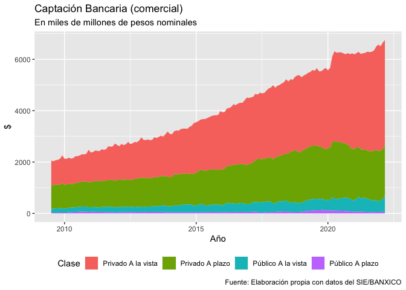

Tarea IV
================
Macroeconomía II
5/4/2022

Realice los siguientes ejercicios con el equipo señalado.

**1. Resuelva los ejercicios 10.4 y 10.5 (5a edición). Realice estos con
ayuda de su laboratorista y entregue las soluciones escritas a máquina,
utilizando LaTeX. \[1 hora, 1 punto cada pregunta\]**

**2. Estudie el financiamiento del sistema bancario en México a la luz
del concepto de “transformación de madurez”: \[2 horas, 1 puntos cada
inciso\]**

**(a) Obtenga, del SIE/Financiamiento e información financiera de
intermediarios financieros/ del Banco de México, información de las
formas de financiamiento del sector bancario (comercial) mexicano, y
haga gráficas describiendo la evolución en el tiempo de las distintas
tipos de financiamiento (depósitos a la vista, financiamiento de mercado
y otros) y de la proporción que cada uno representa del total. Es decir,
hay que producir dos gráficas de series de tiempo en la que el valor
total está constituido por varias partes intermedias.**

Para la siguiente respuesta se utiliza la serie
`Principales Activos y Pasivos de la banca comercal (metodología 2018)`.
La pregunta habla acerca de los depósitos a la vista y el financiamiento
de mercado. Entendemos como depósitos a la vista aquellos que son de
exigibilidad inmediata, mientras que excluimos de esta tipificación los
depósitos a plazo. Por otro lado, definimos el financiamiento de mercado
aquel que no incluya al sector público, excluyendo también a las
empresas productivas del estado o empresas de participación estatal y
órganos decentralizados. Se presenta una tabla con la tipificación que
se acaba de definir con el nombre y número de series de banxico.

| Sector  | Tipo       | Serie    | Nombres                                                                                     |
|:--------|:-----------|:---------|:--------------------------------------------------------------------------------------------|
| Privado | A la vista | SF320773 | d Captación - d.1 Sector privado no bancario residente - d.1.1 De exibilidad inmediata      |
| Público | A la vista | SF320776 | d Captación - d.2 Banca de desarrollo - d.2.1 De exibilidad inmediata                       |
| Público | A la vista | SF320779 | d Captación - d.3 Otros intermediarios financieros públicos - d.3.1 De exibilidad inmediata |
| Público | A la vista | SF320782 | d Captación - d.4 Sector público no financiero - d.4.1 De exibilidad inmediata              |
| Privado | A la vista | SF320785 | d Captación - d.5 Sector no residente - d.5.1 De exibilidad inmediata                       |
| Privado | A plazo    | SF320774 | d Captación - d.1 Sector privado no bancario residente - d.1.2 A plazo                      |
| Público | A plazo    | SF320777 | d Captación - d.2 Banca de desarrollo - d.2.2 A plazo                                       |
| Público | A plazo    | SF320780 | d Captación - d.3 Otros intermediarios financieros públicos - d.3.2 A plazo                 |
| Público | A plazo    | SF320783 | d Captación - d.4 Sector público no financiero - d.4.2 A plazo                              |
| Privado | A plazo    | SF320786 | d Captación - d.5 Sector no residente - d.5.2 A plazo                                       |

Tipificación

A continuación se presentan las gráficas.

<!-- -->

**(b) Obtenga de la misma fuente información del tipo de créditos que el
sistema bancario (comercial) mexicano otorga, y haga gráficas
describiendo la evolución en el tiempo de distintos tipos de crédito y
de la proporción que cada uno representa del total. Al igual que en el
inciso anterior, hay que producir dos gráficas de series de tiempo en la
que el valor total está constituido por varias partes intermedias.**

**(c) Explique si los datos son consistentes con la hipótesis de que los
bancos hacen transformación de madurez o si no lo son y porqué. Para
ello posiblemente tenga que hacer supuestos (razonables) o buscar
información adicional acerca de la madurez de los distintos tipos de
financiamiento y crédito otorgado.**

**(d) Explique qué implica la evolución de las formas de financiamiento
y los tipos de crédito otorgados que observó en los incisos anteriores
para la estabilidad del sistema financiero a la luz del modelo
Diamond-Dybvig.**

**(e) A propósito, documente el incremento dramático a lo largo del
tiempo en el crédito hipotecario como proporción del PIB.**

**3. Estudie al gobierno mexicano y a los corporativos mexicanos desde
el punto de vista de su endeudamiento \[1 hora, 1 punto cada inciso\]:**

**(a) Utilice datos del SIE/Valores en Circulación y de SIE/Finanzas
públi- cas del Banco de México para describir la evolución a lo largo
del tiempo de la composición de la deuda del gobierno mexicano por tipo
de instrumento, madurez y moneda. Señale la implicación de lo que
encuentre para el riesgo de impago.**

**(b) Utilice datos del SIE/Valores en Circulación o para describir la
com- posición a lo largo del tiempo de la deuda del del sector privado
no financiero mexicano por madurez y moneda. Señale la implicación de lo
que encuentre para el riesgo de impago.**

**(c) Describa la evolución de las cifras anteriores durante la pandemia
de Covid-19, es decir entre principios de 2020 y hasta la fecha.**

**4. Proponga una mejora al archivo Diccionario de Economía utilizando
github.**
